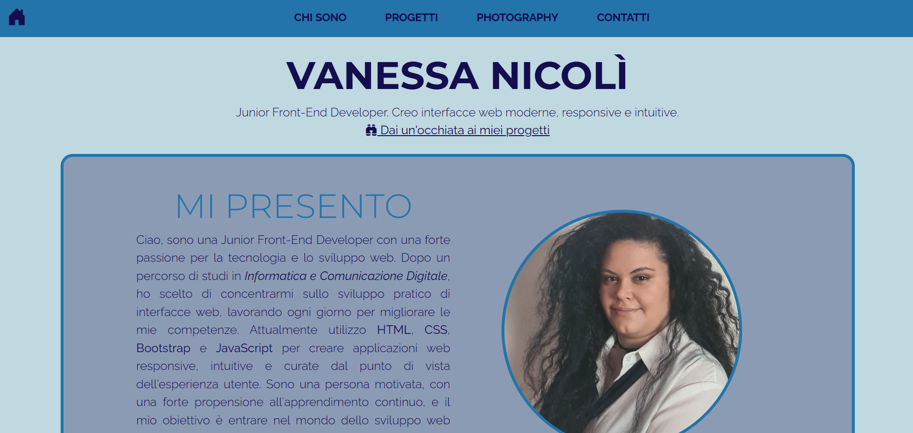
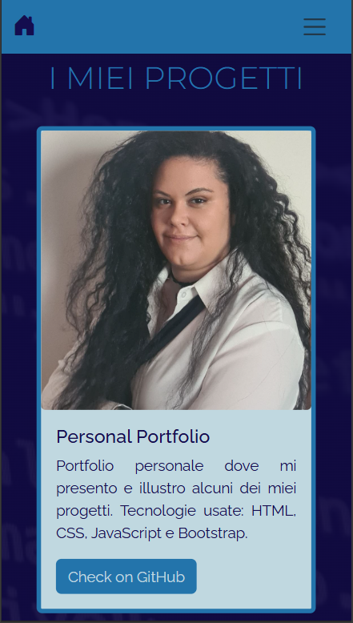
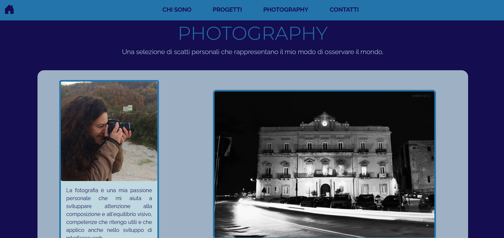
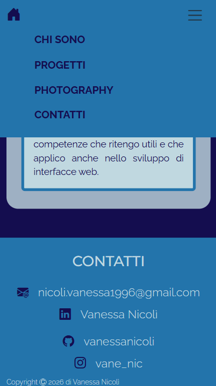

# Vanessa Nicolì | Front-End Developer Portfolio

---

## About me
Sono una Junior Front-End Developer con background in *Informatica e Comunicazione Digitale*.  
Mi appassiona trasformare idee in interfacce web moderne, responsive e intuitive, con particolare attenzione all’esperienza utente e ai dettagli visivi.

---

## Tech Stack
- HTML5
- CSS3 (Flexbox, Grid)
- Bootstrap 5
- JavaScript
- Swiper.js
- Git & GitHub
- Responsive Design (Mobile-first)

---

## Features
- Layout completamente responsive ottimizzato per mobile-first
- Navigazione tramite anchor links
- Sezione progetti con card interattive
- Galleria fotografica con Swiper.js
- Design pulito e coerente

--- 

## Preview
### Preview Home
  
### Preview section projects - Mobile
  
### Preview section photography

### Preview navbar/footer - Mobile


--- 

## Live Demo
Link: [View Live Demo](https://enchanting-swan-45701c.netlify.app/)

--- 

## Project Structure
```text
    Portfolio_Personale  
        ├── index.html  
        ├── css/  
        │   └── style.css  
        ├── js/  
        │   └── main.js  
        ├── assets/  
        │   └── images/   
        │       └── coding-bg.jpg  
        │       └── personal-photo.jpg  
        │       └── cards/  
        │           └── personal-photo-square.jpg  
        │           └── personal-photography-square.jpg  
        │       └── swiper/  
        │           └── photo-castello-aragonese.JPG  
        │           └── photo-owl.JPG  
        │           └── photo-palazzo-orologio.png  
        │           └── photo-sun-flowers.JPG  
        │           └── photo-sunset.jpg  
        │           └── photo-village.JPG  
        └── README.md
```
---

## Project Goal
Questo progetto rappresenta il mio portfolio personale e verrà aggiornato nel tempo con nuovi progetti e competenze.

---

## Contact
Email: nicoli.vanessa1996@gmail.com  
LinkedIn: https://www.linkedin.com/in/vanessa-nicol%C3%AC/  
GitHub: https://github.com/vanessanicoli

---

## Notes
Progetto in continuo aggiornamento.  
Nuove funzionalità e progetti verranno aggiunti progressivamente per riflettere la mia crescita come developer.